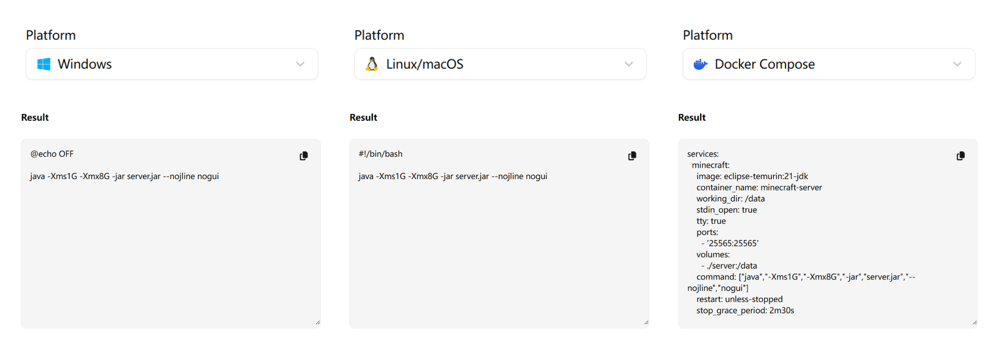
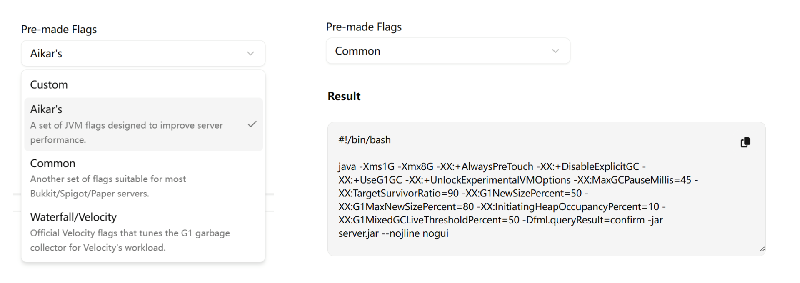
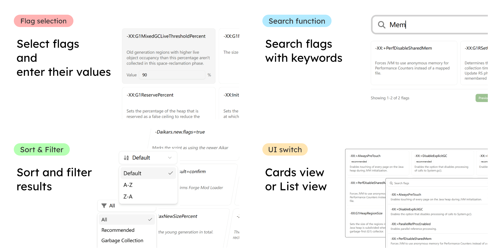
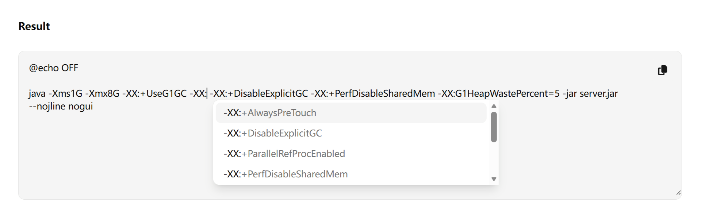
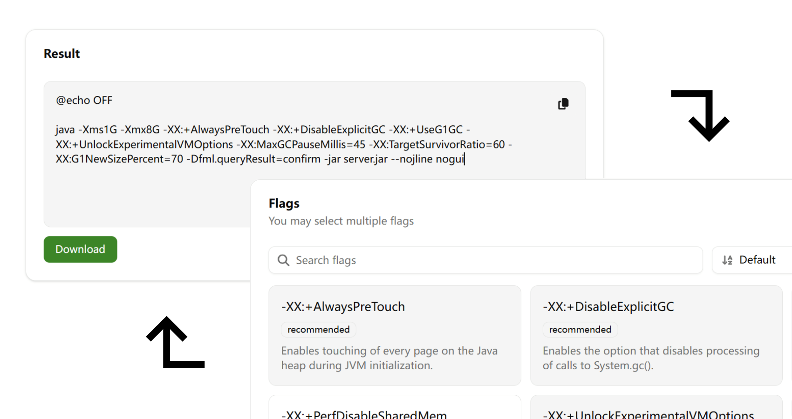
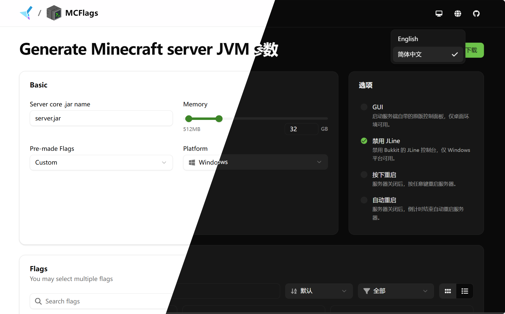

<a name="readme-top"></a>
<div align="center">

<a href="#">
  
</a><br>

<h1>
  MCFlags
</h1>

<p>
  A website to help you generate Minecraft server JVM startup flags.
</p>

[![Pull Requests][github-pr-badge]][github-pr-link]
[![Issues][github-issue-badge]][github-issue-link]
[![License][github-license-badge]](LICENSE)

</div>


<!-- Main Body -->

## Introduction
A simple and user-friendly website to help Minecraft server owners generate Minecraft server startup scripts with a wide range of JVM flags.

## Features
### Multi-platform support
Generate Minecraft server startup scripts for Windows, Linux/macOS, and Docker Compose.



### Pre-made flag sets
Don't know which flags to use? Choose from preset flag sets such as Aikar's, Common, Waterfall/Velocity, and more.



By choosing Custom, you can start building your flag set from scratch.

You can also [submit your own flag sets](https://github.com/katorlys/mcflags/issues/new?template=2-submit-flag-set.yml).

### Flag selection area
Search, filter, sort, and select JVM flags.



If a flag you use is not included in the list, you can [submit it](https://github.com/katorlys/mcflags/issues/new?template=1-submit-flag.yml).

### Result editor
Edit the generated result directly, with built-in auto-complete and synchronization to the flag selection area.



After generating the result, you can copy it to the clipboard or download it as a file based on your selected platform.

Next time you want to edit your flag set, simply paste it into the editor, and the editor will automatically parse the flags and synchronize them to the flag selection area.



### Dark mode, i18n, a11y
Dark mode, language support, and accessibility are included.




## AI-generated content disclosure
Some parts of the Java command generator code were assisted by AI.

All of the flags and flag sets are manually selected by the developers, based on their experience and research. No AI-generated content is included in the flag descriptions or flag sets.


## Tech Stack
- React
- TypeScript
- Tailwind CSS
- shadcn/ui


## Development
Real-time development:
```bash
pnpm dev
```

Build and preview:
```bash
pnpm build
pnpm preview
```


<!-- /Main Body -->


<div align="right">
  
[![BACK TO TOP][back-to-top-button]](#readme-top)

</div>

---

<div align="center">

<p>
  Copyright &copy; 2026-present <a target="_blank" href="https://github.com/katorlys">Katorly Lab</a>
</p>

[![License][github-license-badge-bottom]](LICENSE)

</div>

[back-to-top-button]: https://img.shields.io/badge/BACK_TO_TOP-151515?style=flat-square
[github-pr-badge]: https://img.shields.io/github/issues-pr/katorlys/mcflags?label=pulls&labelColor=151515&color=79E096&style=flat-square
[github-pr-link]: https://github.com/katorlys/mcflags/pulls
[github-issue-badge]: https://img.shields.io/github/issues/katorlys/mcflags?labelColor=151515&color=FFC868&style=flat-square
[github-issue-link]: https://github.com/katorlys/mcflags/issues
[github-license-badge]: https://img.shields.io/github/license/katorlys/mcflags?labelColor=151515&color=EFEFEF&style=flat-square
<!-- https://img.shields.io/badge/license-CC_BY--NC--SA_4.0-EFEFEF?labelColor=151515&style=flat-square -->
[github-license-badge-bottom]: https://img.shields.io/github/license/katorlys/mcflags?labelColor=151515&color=EFEFEF&style=for-the-badge
<!-- https://img.shields.io/badge/license-CC_BY--NC--SA_4.0-EFEFEF?labelColor=151515&style=for-the-badge -->
